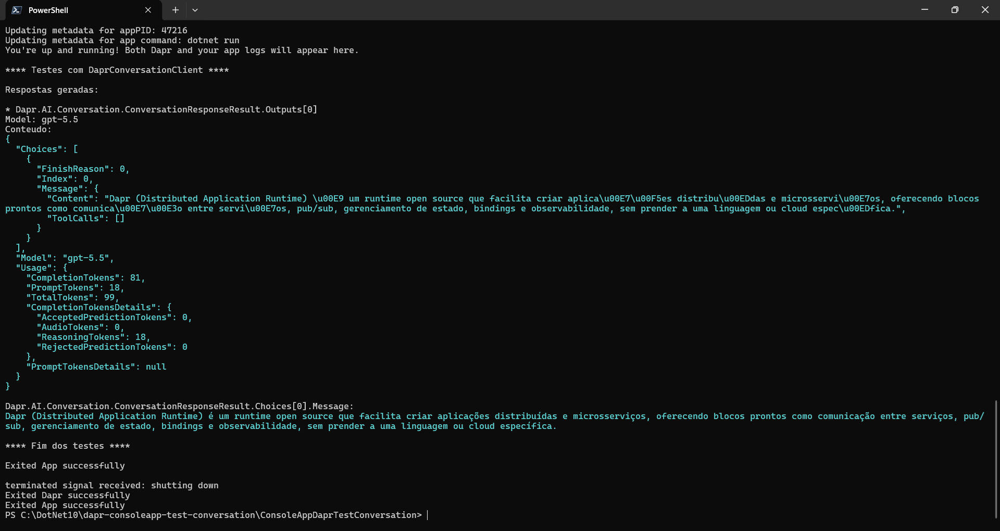
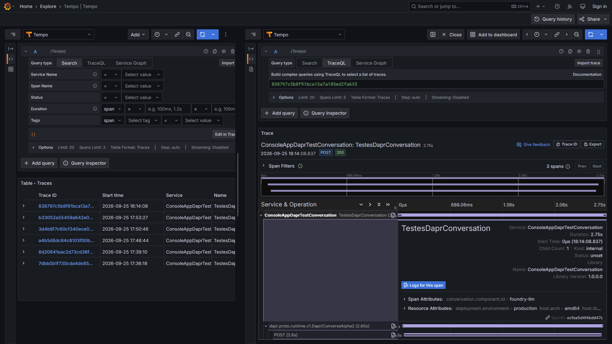
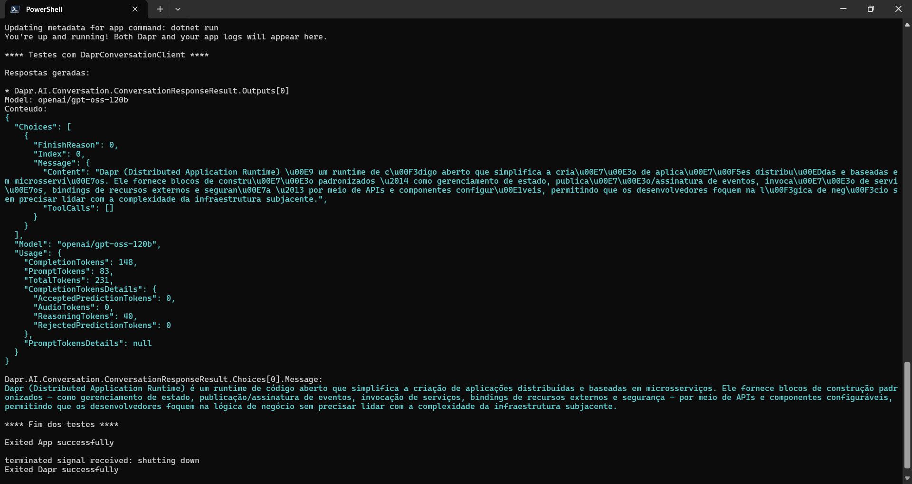
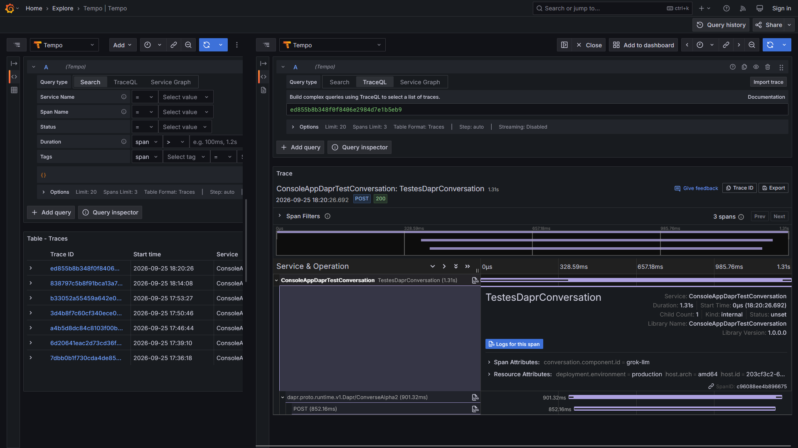

# dotnet10-consoleapp-dapr-conversation-otel-grafana_ai-tests
Exemplo de Console Application criada com o .NET 10 + ASP.NET Core para testar IAs Generativas utilizando o building block de Conversation do projeto Dapr. Inclui exemplos em YAML com Microsoft Foundry e Grok, monitoramento com OpenTelemetry + stack Grafana, além de um arquivo do Docker Compose para criação de ambiente de testes.

## Testes

Testes com o Microsoft Foundry:

Trace gerado:

Testes com o Grok:

Trace gerado:

